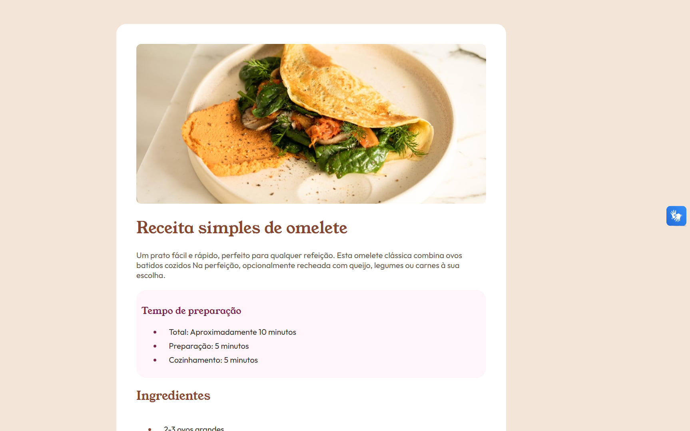

# Frontend Mentor - Recipe page solution

Esta é a minha solução para o [desafio da página de receita no Frontend Mentor](https://www.frontendmentor.io/challenges/recipe-page-KiTsR8QQKm). Os desafios do Frontend Mentor ajudam você a melhorar suas habilidades de codificação construindo projetos realistas.

## Índice

- [Visão Geral](#visão-geral)
  - [O desafio](#o-desafio)
  - [Screenshot](#screenshot)
  - [Links](#links)
- [Meu processo](#meu-processo)
  - [Feito com](#feito-com)
  - [O que eu aprendi](#o-que-eu-aprendi)
  - [Desenvolvimento contínuo](#desenvolvimento-contínuo)
  - [Recursos úteis](#recursos-úteis)
- [Autora](#autora)

## Visão Geral

### O desafio

O objetivo foi construir esta página de receita e deixá-la o mais próxima possível do design original fornecido pelo Frontend Mentor. A página é totalmente responsiva, ajustando-se perfeitamente de telas de desktop para dispositivos móveis.

### Screenshot




### Links

- URL da Solução: [https://github.com/Manuella-Maia/recipe-page-challenge](https://github.com/Manuella-Maia/recipe-page-challenge)
- URL do Site ao Vivo: [https://manuellamaia.github.io/SEU-REPOSITORIO/](https://manuellamaia.github.io/SEU-REPOSITORIO/)

## Meu processo

### Feito com

- HTML5 semântico (tags como `<main>`, `<section>`, `<table>`)
- Propriedades personalizadas de CSS (Variáveis `:root`)
- Flexbox (Para centralização e alinhamento do card)
- Fluxo de trabalho Mobile-first
- Fontes do Google (Young Serif e Outfit)

### O que eu aprendi

Neste projeto, foquei em aprender como organizar um layout limpo usando variáveis CSS e seletores modernos. Foi muito interessante aprender a personalizar os marcadores de lista e fazer cálculos de largura dinâmica para o modo mobile.

Exemplos de código que apliquei:

```css
/* Estilizando a cor das bolinhas (marcadores) da lista */
li::marker {
  color: var(--brown-800);
  font-weight: 700;
}

/* Ajuste da imagem para "sangrar" até a borda em telas pequenas */
@media (max-width: 700px) {
  img {
    margin: -24px -24px 24px -24px;
    width: calc(100% + 48px);
    border-radius: 0;
  }
}